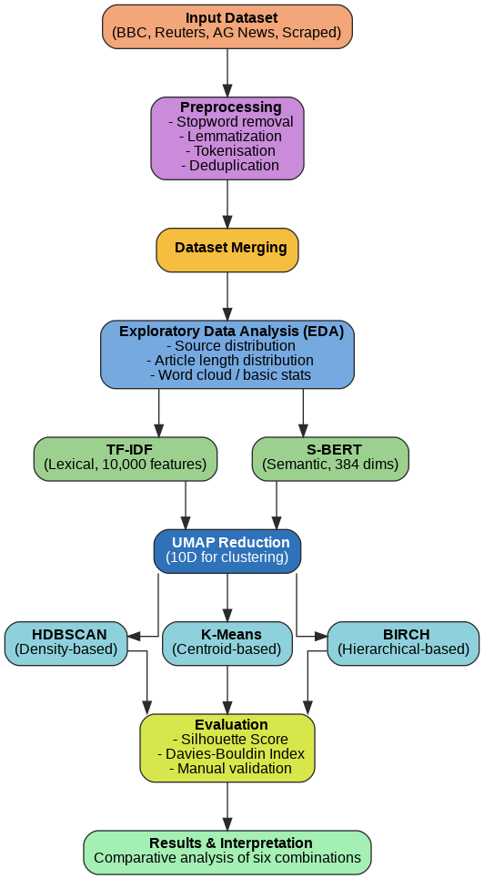
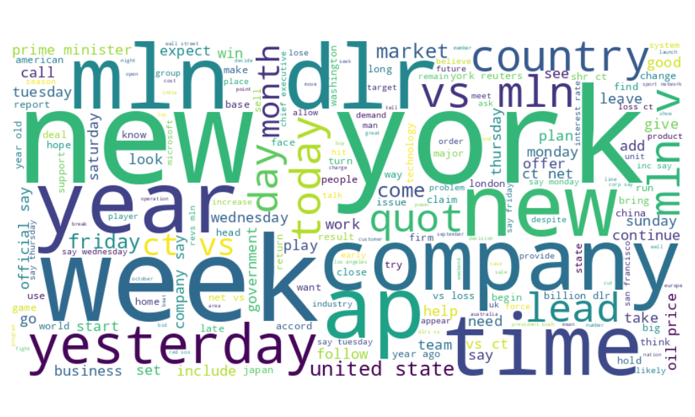

# News Article Clustering by Topic Similarity

## Overview
A large-scale comparative NLP study exploring how different vectorization and clustering techniques perform on 138,115 real-world news articles.

This project goes beyond typical small-scale experiments by systematically evaluating six vectorization–clustering pipelines, combining:

- Lexical representations (TF-IDF)  
- Semantic embeddings (S-BERT)  
- Three clustering paradigms (HDBSCAN, K-Means, BIRCH)  

The goal is to uncover meaningful topic structures in unlabelled news data and evaluate both quantitative performance and human interpretability.

---

## Key Insight

Less commonly used methods outperformed traditional baselines.

- HDBSCAN + TF-IDF achieved the strongest internal validation:
  - Silhouette Score: 0.6692  
  - Davies-Bouldin Index: 0.4173  

- BIRCH + TF-IDF produced the most coherent clusters (sample manual validation):
  - Accuracy: 94.9%  

Despite the rise of embeddings, TF-IDF remains highly competitive at scale.

---

## Dataset

A combined corpus of 138,115 articles from multiple sources:

- BBC News (Kaggle)  
- Reuters-21578 (Kaggle)  
- AG News Corpus (Kaggle)  
- Scraped articles:
  - CNN  
  - The Guardian  
  - TechCrunch  

The dataset mixes short-form and long-form content, creating a realistic and heterogeneous corpus for clustering.

---

## Methodology Pipeline

1. Data Collection and Preprocessing  
   - Tokenisation, lemmatisation, stopword removal (spaCy)  
   - Deduplication  

2. Vectorization  
   - TF-IDF (10,000 features)  
   - S-BERT (384 dimensions)  

3. Dimensionality Reduction  
   - UMAP (reduced to 10 dimensions)  

4. Clustering  
   - HDBSCAN (density-based)  
   - K-Means (centroid-based)  
   - BIRCH (hierarchical)  

5. Evaluation  
   - Silhouette Score  
   - Davies-Bouldin Index  
   - Manual validation (topical coherence)  

---

## Exploratory Data Analysis

EDA revealed:

- Right-skewed article length distribution  
- Dominance of shorter AG News entries  
- Longer articles from Reuters and BBC  
- Vocabulary size of 64,090 unique tokens  
- No missing values after preprocessing  

The word cloud confirms that preprocessing successfully removed stopwords while preserving meaningful terms.

---

## Results Summary

| Method   | Vectorization | Silhouette | DB Index | Manual Accuracy |
|----------|--------------|------------|----------|-----------------|
| HDBSCAN  | TF-IDF       | 0.6692     | 0.4173   | 91.23% |
| HDBSCAN  | S-BERT       | 0.6174     | 0.4290   | 92.86% |
| K-Means  | TF-IDF       | 0.4368     | 0.8959   | 74.14% |
| K-Means  | S-BERT       | 0.4020     | 0.9264   | 87.27% |
| BIRCH    | TF-IDF       | 0.4109     | 0.8802   | 94.90% |
| BIRCH    | S-BERT       | 0.4057     | 0.8785   | 91.38% |

---

## Cluster Visualisation

Observations:

- HDBSCAN shows clearer cluster separation and effective noise filtering  
- K-Means assigns all data points but produces weaker separation  
- BIRCH creates compact clusters  

---

## Key Conclusions

- TF-IDF remains competitive with modern semantic embeddings  
- HDBSCAN outperforms K-Means in cluster quality and separation  
- BIRCH achieves the best interpretability based on manual validation  
- Internal metrics alone are insufficient to assess clustering quality  
- All methods scale successfully to large datasets  

---

## Trade-offs

| Method   | Strength | Limitation |
|----------|----------|------------|
| HDBSCAN  | Strong separation and noise handling | Does not assign all points |
| K-Means  | Assigns all data points | Lower cluster quality |
| BIRCH    | Assigns all data points | Lower internal metric scores |

---

## Practical Applications

- News topic detection  
- Trend monitoring  
- Recommendation systems  
- Customer feedback analysis  
- Social media analysis  
- Dataset preparation for supervised learning  

---

## Tech Stack

Python, Scikit-learn, HDBSCAN, Sentence-Transformers, UMAP, spaCy, Pandas, NumPy, Matplotlib, Seaborn, PaCMAP, Plotly, Google Colab  

---

## Research Contribution

This project:

- Evaluates clustering at large scale (>100K articles)  
- Compares six vectorization–clustering combinations  
- Includes underexplored methods (HDBSCAN and BIRCH)  
- Combines internal metrics with sample manual validation  

---

 
- Domain-specific or balanced datasets  

---

## Disclosure

Parts of the code were developed with AI-assisted tools. All experimentation, evaluation, and conclusions are the author's own.
